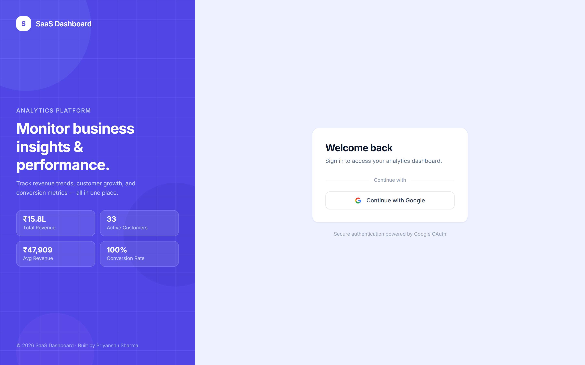

# SaaS Analytics Dashboard



A modern SaaS-style analytics dashboard built with React, Redux Toolkit, Tailwind CSS, and Recharts.

This project simulates a production-style SaaS analytics interface with dynamic filtering, data visualization, and reporting workflows.

---

## Features

### Dashboard
- KPI & metric cards
- Revenue trend chart
- Customer growth chart
- Dynamic filters
- Skeleton loading states
- Animated metric counters

---

### Reports
- Transaction history table
- Live summary metrics
- Multi-criteria filtering
- Search functionality
- Export reports (CSV / JSON)
- Empty state UI

---

### Global UI
- Responsive layout
- Route-aware header
- Active sidebar navigation
- Modern SaaS design system

---

## Tech Stack

- React
- Vite (JS + SWC)
- Redux Toolkit
- Tailwind CSS
- Recharts
- React Router

---

## Getting Started

### Install dependencies

```bash
npm install
```

### Run development server

```bash
npm run dev
```

### Build for production

```bash
npm run build
```

### Project Structure

```bash
src/
    app/
        routes.jsx

    components/
        layout/
        dashboard/
        charts/
        filters/
        table/
        ui/
        modals/

    pages/
        Dashboard.jsx
        Reports.jsx

    services/
        mockData.js

    hooks/
        useCountUp.js
```

### Data Model

The app uses mock datasets to simulate backend-driven analytics:

- Revenue time-series data
- User growth metrics
- Transaction records

No backend required.

### UI/UX Patterns Demonstrated

- Derived state calculations
- Dynamic filtering engine
- Skeleton loading UI
- Count-up animations
- Modal workflows
- Reusable component architecture

### Purpose

Designed as a portfolio-quality frontend engineering project demonstrating SaaS dashboard design patterns and modern UI architecture.

### Future Enhancements

- Analytics deep-dive page
- Pagination system
- Theme switching
- Real API integration
- Advanced charts

---

## Contact

Feel free to reach out to me with any inquiries, opportunities, or collaborations. You can contact me at:

- Email: [priyanshusharma0326@gmail.com](mailto:priyanshusharma0326@gmail.com)
- LinkedIn: [Priyanshu Sharma](https://www.linkedin.com/in/priyanshusharma0326)
- Portfolio: [portfolio-xtechilad.vercel.app](https://portfolio-xtechilad.vercel.app/)

---

## Social

Connect with me on social media:

- Twitter: [@xtechilad](https://twitter.com/xtechilad)
- Instagram: [@xtechilad](https://www.instagram.com/xtechilad)
- GitHub: [@priyanshusharma0326](https://github.com/priyanshusharma0326)

Let's engage, share ideas, and stay connected!